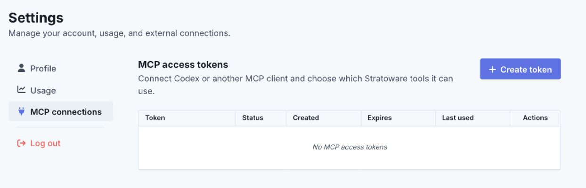
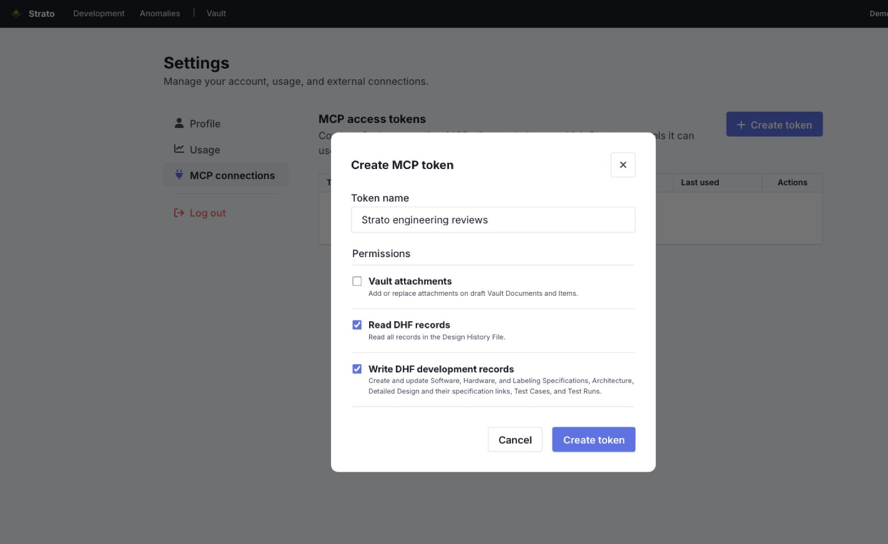

# Create a Strato access token

[← Codex setup](codex.md#2-connect-strato) · [← Claude Code setup](claude-code.md#2-connect-strato)

An MCP access token lets your coding assistant access Strato on your behalf.

## 1. Open Connectors

Sign in to your Strato tenant. Select **Profile** in the top navigation, then **Settings → Connectors → Advanced/manual connections → Create token**. Earlier Strato versions label this section **MCP connections**, as shown in the screenshots below.

## 2. Choose permissions

Enter a recognizable name, such as **Strato engineering reviews**.

| Permission                        | Select it when…                                                                       |
| --------------------------------- | ------------------------------------------------------------------------------------- |
| **Read DHF records**              | Always: the skills need it to read your records.                                     |
| **Write DHF development records** | You want the assistant to apply selected specification, design, or Test Case changes. |
| **Vault attachments**             | Not needed for these skills; clear the checkbox if selected.                          |

The example allows reviews and selected authoring. For read-only reviews, select only **Read DHF records**.

## 3. Save the token

Select **Create token**. In **Your new MCP token**, select **Copy token** and save it securely before selecting **I have saved the token**.

Strato shows the token only once. Keep it out of project files, chat prompts, and the plugin package.

Continue with **[Connect in Codex →](codex.md#2-connect-strato)** or **[Connect in Claude Code →](claude-code.md#2-connect-strato)**.

Screenshots show the local Strato demo interface. No token was created or exposed while capturing them. See [permission details](reference.md#permissions) for scope identifiers.
